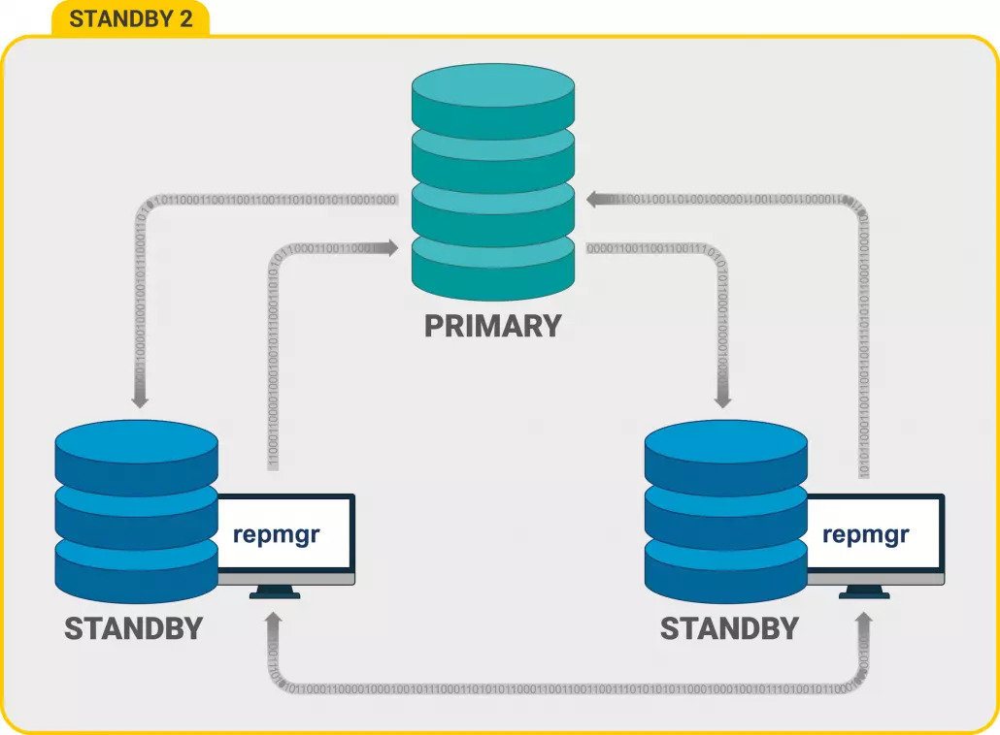
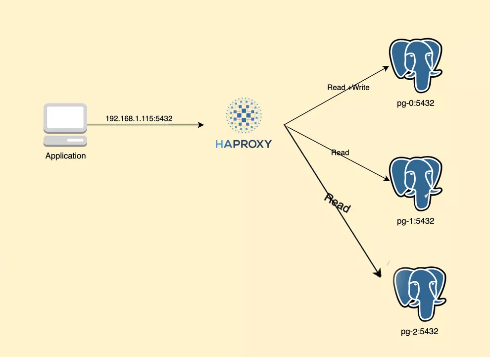
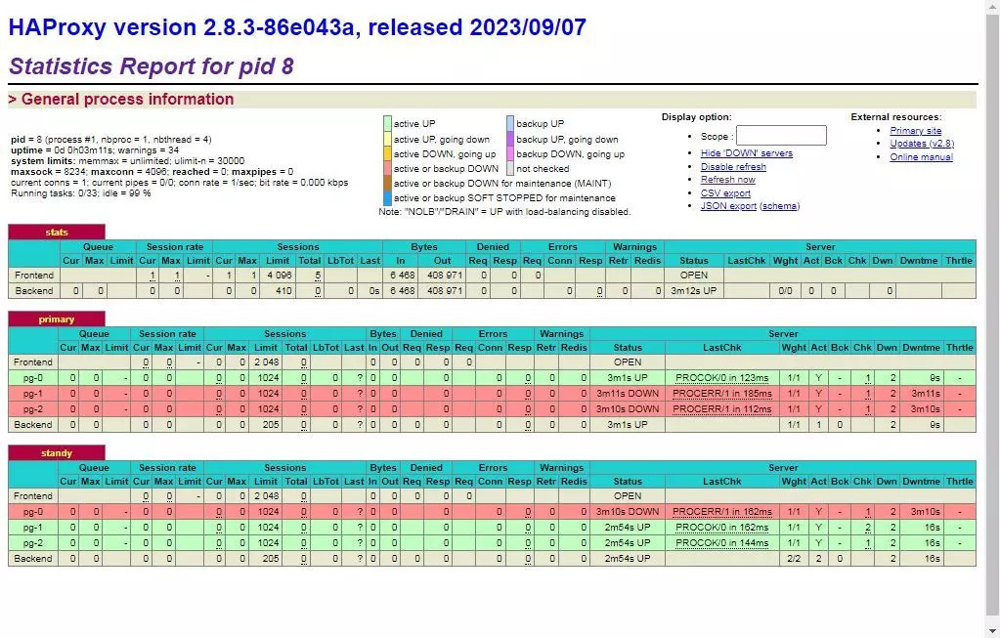

# Postgresql + Repmgr + Haproxy

# Postgres 

Postgres is a powerful, open-source object-relational database system that uses and extends the SQL language with many features that safely store and scale the most complex data workloads. PostgreSQL originated in 1986 as part of the POSTGRES project at the University of California, Berkeley, and has over 35 years of active development on the core platform.


Postgres has earned a reputation for its proven architecture, reliability, data integrity, robust feature set, extensibility, and the commitment of the open source community behind the software to consistently deliver efficient and innovative solutions. PostgreSQL runs on all major operating systems, is ACID compliant since 2001, and has powerful plugins such as the popular geodatabase developer PostGIS. Not surprisingly, PostgreSQL has become the open source relational database of choice for many individuals and organizations.
 
 # Repmgr: 

A popular tool for postgresql replication and error management was introduced by Ndquadrant2 (now EDB) in 2010.

It greatly simplifies the process of setting up and managing databases with high availability (HA) and the required scalability. It helps DBAs and system administrators to manage a set of Postgresql databases using the Hot Standby feature introduced in Postgresql 9.




It simplifies the administration and day-to-day management process, increases productivity, complements internal replication capabilities, and lowers the overall costs of a Postgresql cluster:

Monitor the replication process
Provide support for HA operations such as failover and failover.
It is available through the EDB package repositories as well as the PGDG community repositories. You can use the standard Yum and Apt package managers to install Repmgr with the Postgresql instance.

# HAProxy

which stands for High Availability Proxy, is a popular open source TCP/HTTP Load Balancer and proxy solution that can run on Linux, macOS, and FreeBSD. Its most common use is to improve the performance and reliability of a server environment by distributing the workload across multiple servers (eg web, application, database). It is used in many popular environments including GitHub, Imgur, Instagram, and Twitter.


#

In this part of this post, I'll bring up three postgres servers using docker compose deployment. Then I put HAProxy in front of them, HAProxy detects the original and proxy traffic to this server. The architecture is as follows:



## Deploy PostgreSQL

I will use image from bitnami, they packaged all the need tool for us.


```bash
version: '3.9'

networks:
  web_net:
    external: true
  app_net:
    external: false

volumes:
  pg_0_data:
  pg_1_data:
  pg_2_data:
    
x-version-common:
  &service-common
  image: docker.io/bitnami/postgresql-repmgr:15
  restart: always

x-common-env:
  &common-env
  REPMGR_PASSWORD: repmgr
  REPMGR_PARTNER_NODES: pg-0,pg-1,pg-2:5432
  REPMGR_PORT_NUMBER: 5432
  REPMGR_PRIMARY_HOST: pg-0
  REPMGR_PRIMARY_PORT: 5432
  POSTGRESQL_POSTGRES_PASSWORD: postgres
  POSTGRESQL_USERNAME: postgres
  POSTGRESQL_PASSWORD: postgres 
  POSTGRESQL_DATABASE: postgres 
  POSTGRESQL_SHARED_PRELOAD_LIBRARIES: pgaudit, pg_stat_statements
  POSTGRESQL_SYNCHRONOUS_COMMIT_MODE: remote_write
  POSTGRESQL_NUM_SYNCHRONOUS_REPLICAS: 2

services:
  pg-0:
    <<: *service-common
    networks:
    - app_net
    volumes:
      - pg_0_data:/bitnami/postgresql
    environment:
      <<: *common-env
      REPMGR_NODE_NAME: pg-0
      REPMGR_NODE_NETWORK_NAME: pg-0

  pg-1:
    <<: *service-common
    networks:
    - app_net
    volumes:
      - pg_1_data:/bitnami/postgresql
    environment:
      <<: *common-env
      REPMGR_NODE_NAME: pg-1
      REPMGR_NODE_NETWORK_NAME: pg-1

  pg-2:
    <<: *service-common
    networks:
    - app_net
    volumes:
      - pg_2_data:/bitnami/postgresql
    environment:
      <<: *common-env
      REPMGR_NODE_NAME: pg-2
      REPMGR_NODE_NETWORK_NAME: pg-2

  haproxy:
    #image: haproxy
    build: .
    container_name: haproxy
    restart: always
    networks:
    - app_net
    - web_net
    mem_limit: 8192m
    ports:
    - '3000:3000'
      # - '${POSTGRES_PRIV_IP}:5432:5432'
    privileged: true
    volumes:
      - ./haproxy.cfg:/usr/local/etc/haproxy/haproxy.cfg

```


In the docker-compose.yml above, i defined two services, pg-0 and pg-1 and pg-2. pg-0 is the initial primary server. Let deploy it first using docker compose up pg-0


## The content of haproxy.cfg


```bash
global
    maxconn 4096
    ulimit-n 30000
    external-check
    insecure-fork-wanted
    log stdout format raw daemon notice

resolvers docker
    nameserver dns1 127.0.0.11:53
    hold valid 10s

defaults
    log     global
    mode    tcp
    option  tcplog
    option  dontlognull
    option tcp-check
    option srvtcpka
    http-reuse aggressive
    timeout client  180m
    timeout server  180m
    timeout connect 2s1

listen stats
    bind *:3000
    mode http
    stats enable
    stats uri /
    stats refresh 2s


listen primary
    bind *:5432
    maxconn 2048
    option external-check
    external-check command /opt/services/postgres/primary-check.sh
    default-server resolvers docker init-addr none check inter 2s fall 1 rise 2 slowstart 4000
    server pg-0 pg-0:5432 maxconn 1024 check inter 1s
    server pg-1 pg-1:5432 maxconn 1024 check inter 1s
    server pg-2 pg-2:5432 maxconn 1024 check inter 1s

listen standy
    bind *:5433
    maxconn 2048
    option external-check
    balance roundrobin
    external-check command /opt/services/postgres/standby-check.sh
    default-server resolvers docker init-addr none check inter 2s fall 1 rise 2 slowstart 4000
    server pg-0 pg-0:5432 maxconn 1024 check inter 1s
    server pg-1 pg-1:5432 maxconn 1024 check inter 1s
    server pg-2 pg-2:5432 maxconn 1024 check inter 1s


```

In haproxy.cfg config, i defined external health-check command so i can detect which service is primary and also standby. I used function pg_is_in_recovery(), you can check it here.


The primary-check.sh is look like this.

```bash
#!/bin/bash
VIP=$1
VPT=$2
RIP=$3

PG_MONITOR_USER=postgres
PG_MONITOR_PASS=postgres
PG_MONITOR_DB=postgres

if [ "$4" == "" ]; then
  RPT=$VPT
else
  RPT=$4
fi

STATUS=$(PGPASSWORD="$PG_MONITOR_PASS" /usr/local/pgsql/bin/psql -qtAX -c "select pg_is_in_recovery()" -h "$RIP" -p "$RPT" --dbname="$PG_MONITOR_DB" --username="$PG_MONITOR_USER")

#echo "$@ status=$STATUS"

if [[ "$STATUS" == "f" ]]
then
  exit 0
else
  exit 1
fi
```


The standby-check.sh is look like

```bash
#!/bin/bash
VIP=$1
VPT=$2
RIP=$3

PG_MONITOR_USER=postgres
PG_MONITOR_PASS=postgres
PG_MONITOR_DB=postgres

if [ "$4" == "" ]; then
  RPT=$VPT
else
  RPT=$4
fi

STATUS=$(PGPASSWORD="$PG_MONITOR_PASS" /usr/local/pgsql/bin/psql -qtAX -c "select pg_is_in_recovery()" -h "$RIP" -p "$RPT" --dbname="$PG_MONITOR_DB" --username="$PG_MONITOR_USER")

if [[ "$STATUS" == "t" ]]
then
  exit 0
else
  exit 1
fi
```
Of course, to copy these configs in haproxy, I wrote a docker file, this file should be next to other files.

## Dockerfile
```bash
# Use an HAProxy base image
FROM haproxy:latest

# Switch to root user for package installation
USER root

# Install PostgreSQL and other necessary packages
RUN apt-get update && apt-get install -y postgresql-client

# copy bash file to the iamge
COPY standby-check.sh /opt/services/postgres/standby-check.sh
COPY primary-check.sh /opt/services/postgres/primary-check.sh

# Set permissions to 777 for your two files
RUN chmod 777 /opt/services/postgres/primary-check.sh  && chmod 777  /opt/services/postgres/standby-check.sh


```


1- compose pull images  
2- docker network create web_net  
3- docker compose up -d



Open http://localhost:3000 to watch stats.

